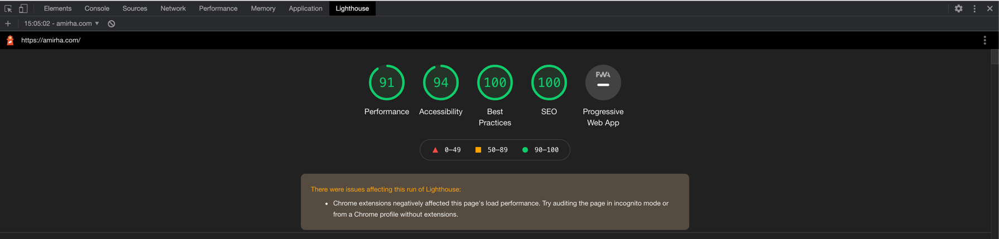

# Amirha.com (2021)

2021 Redesign of my personal website.

## ✨ New Features

Here's a list of new features in this version compared to the last:

- New 2021 Design with updated content (Designed using `Framer`, compared to `Figma` last time)
- Significantly better responsiveness
- Typescript
- `snowpack` for local development
- Create production bundle using `esbuild`
- Configured to use `Web Test Runner` as test runner (instead of usual `jest`)
- `pnpm` as package manager
- Deployed via Github Pages (Compared to Gitlab pages and Gitlab CI last time)
- Use Chakra UI component library
- (Some) Animation
- Setup (Google) Analytics for gathering data to improve site
- Visual testing with [Cypress](https://www.cypress.io/) and [Percy](https://percy.io)
  Runs automatic every day via CI (Github workflow)

- [ ] Dark/Light colour themes

### 🔨 Development

Ensure you've got `pnpm` installed globally: `npm i -g pnpm`

- To install all dependencies: `pnpm install`
- To run a local dev server: `pnpm start`. (This uses `snowpack` under the hood)
- To build a production bundle: `pnpm build`. (This uses `esbuild` via `snowpack`)
- To deploy a new release: `pnpm deploy`. This assumes appropriate github token is available - it will run the build
  step and push the generated dist directory to a branch called `gh-pages` which is configured to publish to the site.

#### End to End Visual testing

This project is using Cypress and Percy for end-to-end visual testing. Both are overkill for a project this simple and
there are many easier ways of achieving the same thing however some features they provide will be more time-consuming to
replicate with other tools such as taking snapshots at various screensize and automatic diffing of any visual
regression.

Percy requires an account on their platform. The setup required creating a corresponding project on their platform and
generating a token to be used when running the tests.

To run the tests locally:

```sh
PERCY_TOKEN=<TOKEN> percy exec -- cypress open
# or
PERCY_TOKEN=<TOKEN> pnpm test-e2e
```

Note how cypress command needs to be wrapped by the `percy` command to ensure the snapshots are captured and sent to the
dashboard.

The CI/Github Workflow are configured to have access to the percy token via action secrets. The CI is configured to run
against the live website. It's setup on a daily cron job and can be also be manually triggered via workflows.

### Performance

Chrome Lighthouse report results after some optimisations:


Optimisations performed:

- Alt tag for all images
- Appropriate text size at all locations
- Minify JS
- Add CSS/HTML only loading spinner to root element in index.html - this reduces time to first paint significantly
- Remove inactive links
- Use webp image format - images are 5x to 30x smaller! (The large image must have had no compression applied until now)
  To convert images to this format: `cwebp -q 70 <image>.png -o <image>.webp`
